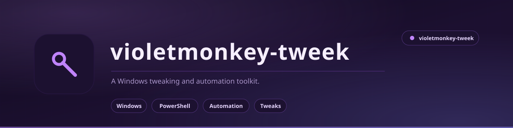

<picture>
  <source media="(prefers-color-scheme: light)" srcset="docs/assets/banner-light.svg">
  <source media="(prefers-color-scheme: dark)" srcset="docs/assets/banner.svg">
  
</picture>

 

**Violetmonkey Tweek**

A Windows tweaking and automation toolkit.

 

---

## Status

**In development.** The repository is being set up - there is no usable build yet.

This README will be replaced with the real documentation once there is something to document. If you landed here looking for working software, there is nothing to run yet.

---

## What it will be

A toolkit for the Windows changes that are tedious to do by hand and easy to get wrong: registry tweaks, service and startup configuration, and scripted setup for a fresh machine.

The intent is the same as my other tools - every change is reversible, every change is logged, and nothing happens without you being able to see what it will do first.

---

## Licence

MIT - see [LICENSE](LICENSE).

Built by **Aizenrex x Riyad**.
